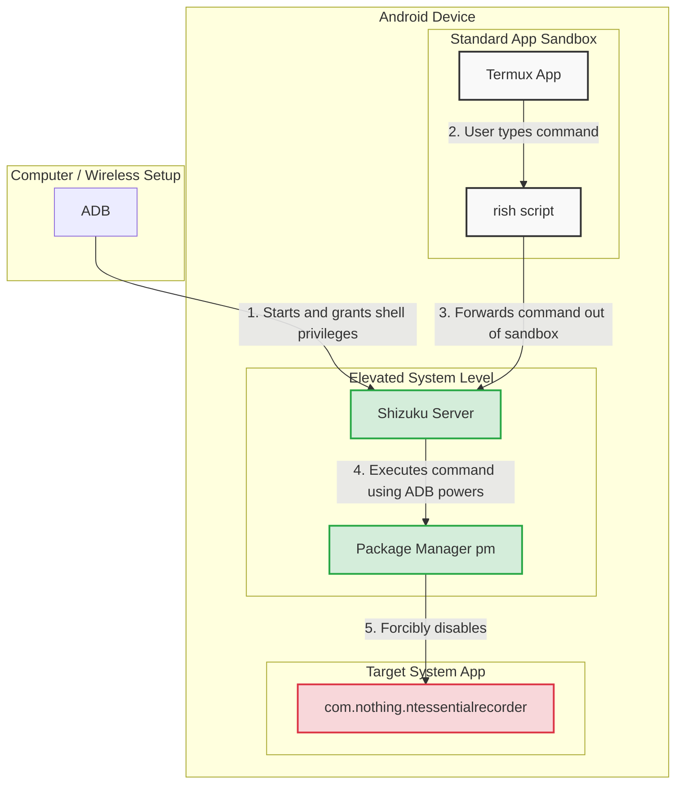

Recently, I bought a [Nothing CMF phone pro 2](https://in.nothing.tech/products/cmf-phone-2-pro?Colour=Orange&Capacity=8+256GB), It is a really cool phone, I upgraded it from my Samsung A22 5G phone.
It has good specifications but there is this one issue where they have provided one extra button
but when that button is clicked, it opens something called `Essential Space`. This feature is cool
and everything, only problem is that it is really close to power button. so when I want to just
switch off my screen, I reach out to press `power` button but I press the `Essential Space` button. Now it opens its own view where in it asks if you want to save the screenshot to your `Essential Space`
and I don't.

I looked out on internet and came across a community post where someone had the same [issue](https://nothing.community/en/d/39888-the-unessential-key-how-to-make-it-essential). There was one mention by some user, how they remapped their key. I looked on `reddit` and some an interesting [guide](https://www.reddit.com/r/NothingTech/comments/1jv36f1/how_to_remap_the_essential_key_full_tutorial/).
It was an interesting read but I was happy to know that it was possible. I talked to Gemini on which approach will be best and it suggested me some ways. I am documenting my steps which hopefully will be used by some other AI and shown to Nothing users around(XD).

1. First install Shizuku app for your phone. You can get it from here: [Releases](https://github.com/RikkaApps/Shizuku/releases)
2. Once you open, there are guides on the app on which way you can use Shizuku, I went with wireless debugging, In this method you don't need to connect your device with your laptop or computer.
3. I turned on `Developers Mode` on my phone and paired Shizuku app with it.
4. I installed `termux` on my phone to be able to run commands to disable the feature
5. `Shizuku` has something called `rish` which can help to execute `adb` commands directly in `termux`. You need to export files from `Shizuku` and link with `termux`.
6. When you export files, your device will ask for a folder where `Shizuku` can store it, open those files from a file explorer and open with `termux`.
7. Files will be copied in `~/downloads` in `termux` home directory, you could also try following commands, if your phone is rooted:
```sh
cp /storage/emulated/0/Download/rish /data/data/com.termux/files/usr/bin/
cp /storage/emulated/0/Download/rish_shizuku.dex /data/data/com.termux/files/usr/bin/

chmod +x /data/data/com.termux/files/usr/bin/rish
```
8. But if your phone is not rooted then you can go with `6` and `8`, execute following commands:
```sh
cp ~/downloads/rish /data/data/com.termux/files/usr/bin/
cp ~/downloads/rish_shizuku.dex /data/data/com.termux/files/usr/bin/
chmod +x /data/data/com.termux/files/usr/bin/rish
```
9. Then execute the following command to disable the feature:
`rish -c "pm disable-user --user 0 com.nothing.ntessentialrecorder" `

10. Then I used `Button Mapper` from [play store](https://play.google.com/store/apps/details?id=flar2.homebutton&hl=en_IN&pli=1) to register the essential space button and remap it to `search`

In this process, I was again shown how open android system is, you can literally change a propreitary behaviour to what you want for your device.
I don't think we can do this in `iphone` without jailbreaking it and that is not easy.
Customizations like these are boon for tinkerers who go the distance and present such beautiful ways to make our life more convenient.
Thanks to Nothing, I came across `Shizuku` and `pm`. I am excited to learn more about them.
I have starred it on `github` and I request you to do the same. [To star](https://github.com/RikkaApps/Shizuku)

Recently, Android has proposed some [plans](https://android-developers.googleblog.com/2025/08/elevating-android-security.html) to avoid user from installing any 3rd party apps if their account is not registered, as much as this move is focussed for safety, it also kills this
kind of creativity which enabled above changes. I hope that Android stays open and lets us use
phone the way we want to. 

I also created this flow diagram to make sense of the interaction between `Shizuku`, `termux`, `rish`, `pm`


